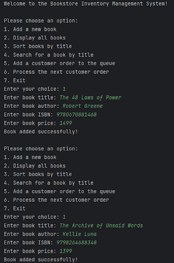
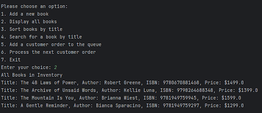
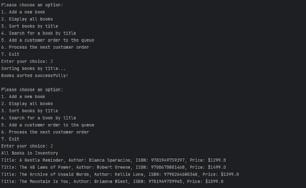
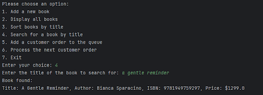
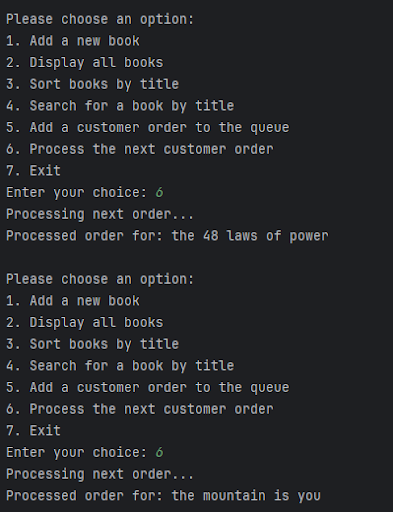

# Bookstore Inventory Management System-DSA Final Project

## Author: Ergio Rafael M. De Guzman

This project is a simple, console-based Bookstore Inventory Management System created for the Data Structures and Algorithms lab. It is written in Java and demonstrates the practical application of fundamental data structures and algorithms, including LinkedLists, Queues, Sorting, and Searching.

## Features

*   **Add New Books**: Users can add new books to the inventory by providing a title, author, ISBN, and price.
*   **Dynamic Inventory Storage**: Utilizes a **`LinkedList`** to dynamically store and manage the collection of books.
*   **Display All Books**: Shows a complete list of all books currently in the inventory.
*   **Sort Inventory**: Implements a **Bubble Sort algorithm** to organize the books alphabetically by title.
*   **Search for Books**: Uses a **Linear Search algorithm** to find a specific book by its title.
*   **Order Processing**: Implements a **`Queue`** to manage customer book orders in a first-in, first-out (FIFO) manner.
*   **Interactive Menu**: A user-friendly, menu-driven interface for easy navigation and operation.

## How to Run the Project

1.  **Prerequisites**:
    *   Java Development Kit (JDK) 8 or higher must be installed.

2.  **Clone the Repository**:
    ```bash
    git clone https://github.com/joo-oo/bookstore-inventory-system
    ```

3.  **Navigate to the Directory**:
    ```bash
    cd bookstore-inventory-system
    ```

4.  **Compile the Java Files**:
    ```bash
    javac *.java
    ```

5.  **Run the Application**:
    ```bash
    java Inventory
    ```

## Sample Output Screenshots

Here are screenshots demonstrating the flow and functionality of the application.

### 1. Main Menu


### 2. Adding New Books


### 3. Displaying All Books (Unsorted)



### 4. Sorting and Displaying Books



### 5. Searching for a Book


### 6. Managing Customer Orders with the Queue




